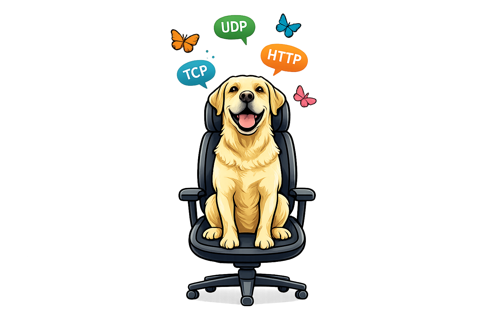

  
   
   
  <a href="https://interceptsuite.com/">Website</a>
  &nbsp;&nbsp;•&nbsp;&nbsp;
  <a href="https://interceptsuite.com/products">Downloads</a>
  &nbsp;&nbsp;•&nbsp;&nbsp;
  <a href="https://interceptsuite.com/pricing">Pricing</a>
  &nbsp;&nbsp;•&nbsp;&nbsp;
  <a href="https://doc.interceptsuite.com/">Docs</a>
   
  

## 🔍 About

InterceptSuite is a MITM proxy built for non-HTTP traffic - TLS, STARTTLS protocols, DTLS, and custom protocols that most interception tools don't cover. It's used by security researchers, pentesters, and developers who need visibility into protocols beyond HTTP/HTTPS.

## 📦 What We Build

**InterceptSuite** - the core product. Cross-platform (Windows, macOS, Linux), Pro-only. Handles TLS/STARTTLS interception, DTLS MITM, PCAP export, and project-based workflows. [Try the free trial →](https://interceptsuite.com)

**[ProxyBridge](https://github.com/InterceptSuite/ProxyBridge)** - a free, open-source proxifier alternative. Redirects TCP/UDP traffic from any application into a SOCKS5/HTTP proxy, filling a gap that existing tools like Proxifier don't cover on Linux or for UDP traffic.

## 🎓 Community Licenses

If you're a student, researcher, or have a genuine non-commercial use case, email **support@interceptsuite.com** with the subject **"Community License"**. We review these individually and issue free Pro licenses where it fits.

## 🐛 Found a Bug?

Open an issue on the relevant repository — for InterceptSuite, reach out via the website; for ProxyBridge, file directly on [GitHub Issues](https://github.com/InterceptSuite/ProxyBridge/issues).
